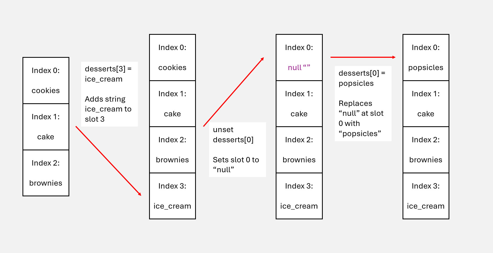

# Intro to Bash

Bash (Bourne-Again SHell) is a command-line interpreter, shell, and scripting language used almost ubiquitously across Unix-base and many macOS systems. Much of the function of bash is based around managing an operating system. Created by Brian Fox in around 1988, BASH has since received continuous development [throughout its history](https://developer.ibm.com/tutorials/l-linux-shells/) and to the present. 

Bash is a very helpful language to learn. It provides a very powerful and direct way to communicate with your computer without using a GUI. However, its power is also a weakness: there are no "undo" buttons when moving, removing, copying, or otherwise manipulating files or data. It is also ***not*** a good "general purpose" language - it lacks advanced data structures, has primative error handling, and its use cases are very limited. Always write bash scripts with this in mind. This guide will definietly not cover *everything*, as that is impossible to do in a single, small-scale excersize. If you are interested further in more complicated bash topics, the greatest place to start is [the official bash documentation](https://www.gnu.org/savannah-checkouts/gnu/bash/manual/bash.html).

It is recommended not to learn bash as your first programming "language" - rather, use it as a supplement to another language you already know. Bash (and sh) is a "command-line interpreter and shell" first and a "language" second.  


## The very basics: Handling and printing output

The best place to start when learning bash is expriementing with how bash handles input and output. Not only do you learn how to print to screen, but it gives you a taste of the *power* than bash has. If you go to the ***hello*** subdirectory, you will notice a simple file titled hello.sh. To run this, simply type
```
 $ sh hello.sh
```
Note that the proper file extension for a bash script is *".sh"*. This is not strictly neccesary for the script to run, but it marks the file as a *shell script*, or a script executed by the Unix/macOS/whatever shell interpreter. The file extension is moreso used so that the user or reader knows the intended use of the file. Some programmers might even use a *".bash"* extension to be more specific. 

Once you have run the script, it should print something like this to terminal:

```
Hello World!
...
...
...
...
...
Goodbye, World!
```
If you take a look at the contents of the file, you will notice it uses the "echo" command to print to the screen. This is not the only way print output - we will discuss more on this in the **String Manipulation** section. 


This is nice and all, but not very interesting. There is so much more we could be doing with this file.

Let's say, for example, we want to save this information to a file. That's easy! We can use the ">" operator to send the contents to any file(s) of our choice. **But be warned,** as this operator will *overwrite* all of the contents of any file with that name. If we try to send the output of this file to an existing file titled "**important-data-do-not-delete.txt**", then congratulations! We have just overwritten some important data. Hope you had a backup!

Now, let's actually try to send some output somewhere. As mentioned before, we can redirect the output of hello.sh by doing
```
sh hello.sh > output.txt
```
If the file output.txt did not exist before, now it does! Taking a look inside of that new file will most definietly have the output you are looking for. But say we instead want not to *overwrite* and file, but *add information to the end* of a file? We can do that to, with the concationation ">>" operator:
```
sh hello.sh >> output.txt
```
We have just added to the end of the file. This is especially useful if you, say, need to sort and add data from multiple data files to a centralized file for easy reading. 

There is one last output-manipulation operator which is perhaps the **most important** one to know: the "|" or "pipe" operator. It allows you to take standard ouput *(stdout)* from one bash script/command and use it as standard input *(stdin)* for another. I like to think of it as "sending" the output from once place directly into another. For example, if we wanted to count how many words are printed to the screen when running `hello.sh`, we could "pipe" the printed output into `wc`, a command that counts words: 
```
sh hello.sh | wc -w
#Notice the -w flag. It specifics to wc to count only words and nothing else (it can count lines, bytes, characters, etc.)
```
Note that pipes can be stacked as many times as you want. You can take the output from `command1 | command2` and directly pipe it to `command3`, all in one line! `command1 | command2 | command3`. There are (obviously) more commands than just `wc`, of which we will discuss in **String Manipulation**

## Variables, Parameters, and Flags

Variables in bash are quite a bit different than many other programming languages. In general, there are three primary variable types: **Scalar Variables**, **Array Variables**, and **Environment Variables**. 

### Scalar Variables

Scalar variables are what comes to mind when we think about the most basic variables, such as strings or integers. They hold only *single* values. The format to declare a scalar variable is shown below:
```
#!/bin/bash

my_string="This is a string"
my_num=3
```
Notice that *there is **no** whitespace* between the variable name and the value. This is important; with whitespace, bash would (for example) read `my_num = 3` as attempting to run a command named `my_num` with `=` and `3` as *parameters*, not assigning them as a *value* in a variable. 

This is also a good time to mention variable types. In bash all variables are generally *untyped* unless declared explicitly. In the example above, the system actually treats `my_num` as a string, not an integer. This can be especially annoying when we need to perform arithmetic on a variable. Bash also *does not* natively support floats. More on this in the **Arithmetic** section.

To refrence a variable at any part in your code, use the `$` symbol in combination with a *brace* `{}` to keep the variable "encapsulated", like so: . 
```
#!/bin/bash

my_string="This is a string"
my_num=3
echo "My string is ${my_string} and my number is ${my_num}"
```
Note that encapsulation is not strictly neccesary, but highly recommended. Without it, bash will attempt to read all characters past the `$` symbol (excluding spaces) as the name of the variable. So if you do not have whitespace between where you are trying to print the variable and the next part of the string, it will fail.
```
echo "$my_string123"  #Results in an error, as the variable is not findable. 
echo "$my_string 123"  #Echoes "my_string 123" to screen (with whitespace)
echo "${my_string}123"  #Echoes "my_string123" to screen
```


You can also "declare" a variable to be a specific type using the `declare --flag` operation, if you wish to fully type your variables. I will not go into fine detail with variable decleration for scalar variables, but if you wish to know more then [this page](https://tldp.org/LDP/abs/html/untyped.html) from **The Linux Documentation Project** has a great exploration of this topic.

|Flag| Description of flag operation |
|----|---------------------------------------------------------------------------------------------------|
| -i | Declare as an integer. Arithmetic expressions inherently handled and evaluated.|
| -a | Declare as an indexed array. This is assumed if not declared. More on this in **Array Variables** |
| -A | Declare as an associative array. More on this in **Array Variables**|
| -r | Declare as read-only, meaning its value cannot be changed.|
| -x | Mark a variable for export to the environment. More on this in **Environment Variables**|
| -p | Print the attributes and value of each variable. Useful for checking variable types|

### Array Variables

In addition to typical scalar variables, bash can also handle 1-dimensional arrays. Since everything including arrays are technically untyped (unless they are declared beforehand), an "array" in bash can feature both strings *and* integers. While one could definietly argue that this would fail the strict definition of an array (I personally would not disagree), remember: **everything is untyped to begin with**. Those "integers" in the array are really just strings.

Arrays as variables are typically declared using the following format:
```
my_array=(data1 data2 data3 data4)  #Space between data points instead of commas, using paranthesis instead of closed brackets.
```
If not explicitly declared using a `declare` operator (like in the example above), bash assume the array is an indexed array. Much like other languages, indexing in bash starts from 0 and goes to N-1 (with N being the length of your array). Unlike other languages, you don't need to specify the array size to add things through indexing. To add an item at index 2, simply write `my_array[n]=<item>`. To delete an item, use `unset my_array[n]`
```
#!/bin/bash

desserts=("cookies" "cake" "brownies")
echo "${desserts[*]}"  #caookies cake brownies
desserts[3]="ice_cream" #Adds item "ice_cream" into slot 3. Since slot does not exist, it creates the new slot
echo "${desserts[*]}" #cookies cake brownies ice_cream
unset desserts[0] #Removes item in slot 0, "cookies", from array.
echo "${desserts[*]}" #cake brownies ice_cream
desserts[0]="popsicles"  #Adds "popsicles" into that slot 0 null character.
echo "${desserts[*]}" #popsicles cake brownies ice_cream
```
**NOTICE**. When using unset on slot 0, all of the items to the right **DO NOT AUTOMATICALLY** shift left to fill the space. This is because bash does not *really* "destroy" the slot for that structure; rather, it sets whatever is at slot 0 to a "null" or "empty string". You can see this more clearly if you run `declare -p desserts` after having removed the 0 slot.

Below is a graph of what is *really* happening:
 

As of bash 4.0 (released in 2009), bash can also handle something called an "associative array", which is an array indexed by keys (strings) instead of numbers. For those of you who are more familiar with languages like C#, Python, or Swift, this acts almost functionally identical to a dictionary. It is also the only variable type that needs to be specifically declared:
```
#!/bin/bash

declare -A colors
colors["red"]="Hex code: FF 00 00"
colors["blue"]="Hex code: 00 00 FF"
echo ${colors["red"]}  #Output: "Hex code: FF 00 00"
```

Be warned when using associative arrays. Since bash places great emphasis on *backwards compatiblility*, these arrays will **not** work on older systems. In the case that you need these kind of structures in an older system, you will need to find a way to find a work around. In addition, bash arrays are not designed to work well for large datasets - they are stored in memory, their operations get slower as the size of the array increases, and they generally don't scale well. It is best to save bash arrays for little tasks.  

### Environment Variables

Environmental variables are fundamental to the Unix/Linux operating system. This is primarily where the concept of bash being a **shell first**, and a **programming language second** - bash's ability to interact with the operating system environment. These special variables give you a lot of power, which requires a lot of care when using them. Here is a multitude of example environment variables. 
|ENV Var| Variable description|
|---------|------------------------------------------------------------|
| $USER   | Gives username of the current user (you, I hope)           |
| $HOME   | Gives filepath to your home directory                      |
| $PATH   | Gives your command searchpath                              |
| $SHELL  | Gives the location of your shell                           |
| $PWD    | Gives the current working directory you are in             |
| $EDITOR | Gives information on the default file editor for the shell |
| $LANG   | Gives the default system language                          |
| $UID    | Gives the user's user ID (hopefully that's you!)

If you are running this training in Odo, or Frontier, or whatever system that is not your own, I would **be very careful** when messing with these. But it is useful in bash scripting to be able to get information such as your current path, user, etc. If you wish to learn more about creating your own environment variables, [look here](https://www.geeksforgeeks.org/linux-unix/environment-variables-in-linux-unix/).

### Special Variables

If you have been paying attention to the last few code snippits, you might have noticed that each has begun with the line `#!/bin/bash`. This is not a comment, but something called a *shebang* line. The `#!` at the beginning indicates to the shell that the following path (in this case, `/bin/bash`) leads to the interpreter *from which the code is executed*. This is **not** always neccesary; explicitly calling bash to run the script `bash script.sh` can render the shebang uneeded. However, it is **highly recommended** to include this at the start of *each and every bash script you write*.   

There are also special variables that allow you to send *arguments*. This is great for a good number of reasons, from creating *option flags* for your scripts to *sending specific files* that you want the script to interact with. Below is a list of a few of these special variables:

| Special Var. | Action |
|----------------|-----------------------------------------------------------------------------------------|
| $0             | References the name of the script                                                       |
| $1, $2, .., $N | References the parameters up to N after the script, $1 being the first after the script |
| $#             | References the number of parameters sent                                                |
| $@             | Gets all parameters as seperate strings                                                 |
| $*             | Gets all parameters as a singular, combined string                                      |
| $?             | Gets the exit status of the last executed command                                       |
| $$             | Gets the PID (Process ID) of the current script / shell                                 |
| $!             | Gets the PID of the last-executed background command                                    |

The last three are especially useful for debugging. If you wish to see an example of how filenames can be sent as arguments, do the following:

```
$ cd variables  #Make sure you are in the variables subdirectory for this
$ sh arguments.sh <file-you-want-read>.txt  #The filename is sent as $1 
```

I would highly advise you make and mess around with your own variables to get the hang of it. The best way to learn bash **by far** is to practice using it. We will be going more in-detail about writing option flags for your bash scripts as a practice exercise for our **loops** section.
 
## Arithmetic

Arithmetic in bash is a bit... strange. Since every variable is treated as an untyped string, we need to use a different set of operations and syntax to properly do math. It becomes especially tricky once we start to assign numbers to variables. There are a multitude of ways to go about performing mathematical operations in bash, but this guide focuses on two: `$((<op>))` syntax for integer arithmetic and the `bc` command for floating-point numbers. 

### `$((<op>))` syntax

Remember earlier in this guide that taught you how to "encapsulate" string variables to keep them clean and readable? This is why. Similar to how you would use `${}` syntax to mark a variable in a string, you can use `$(())` to mark a section as peforming mathematical operations. Let's look at the example below from file arithmetic/math1.sh:
```
#!/bin/bash

#!/bin/bash

a=14
b=2
c="abc"

echo a + b   #a and b are not refrenced
#a + b
echo $a + $b   #a and b are refrenced, but not added
#14 + 2
echo "$((a + b))"  #a and b are refrenced, encapuslated in arithmetic, and computed
#16
echo "$((a * b))"
#24
echo "$(((a - b) / 2))"  #The rules of PEDMAS still apply. This is how you handle paranthesis.
#6
echo $c
#abc
echo "$((c+3))"  #Attempts to treat c as an integer. Since is is a string, the integer value it assigns is 0.
#3
```
Bash is capable of doing most basic arithmetic out there. But since it does not handle floating-points natively, **any** division result will cut off decimal-place answers. For example, `echo "$((10 / 4))"` would return `2` and drop the `.5` decimal at the end. Below is the proper syntax for all arithmetic done in this way:

| Syntax      | Effect                                               |
|-------------|------------------------------------------------------|
| $((a + b))  | Addition                                             |
| $((a - b))  | Subtraction                                          |
| $(a * b)    | Multiplication                                       |
| $((a / b))  | Division                                             |
| $((a ** b)  | Exponential                                          |
| $((a % b)) | Modulo Division                                      |
| a=$((a += b)) | Incrementation by constant|
| a=$((a -= b)) | Decrementation by constant|
| a=$((a *= b)) | Multiply by constant|
| a=$((a /= b)) | Divide by constant|
| a=$((a %= b) | Modulo by constant|

Of course, this is not the only way to do integer arithmetic in bash. Using the `let` or `expr` commands is valid depending on their context. But I am focusing on this form because it is generally the preffered and most efficent method in most use-cases. You are free to use whatever your project might call for. 

### `bc` command

For handling actual floating-point numbers and more complicated math, you can use the `bc` library. It is important to note that `bc` (or basic calculator, as it is called) is **not** a built-in part of the bash shell; rather, it is a seperate command-line utility written in C (as all good things are) that comes pre-packaged in most, *but not all*, linux distributions. Depending on what version of Linux/macOS version you are running, you might have to install it manually to use it. **This is because native bash has *no* handling of floating-points.**

Because it is not a built-in 

More on what the bc package can do can be found [here](https://www.geeksforgeeks.org/linux-unix/bc-command-linux-examples/).

## String Manipulation 

## Comparisons and If/Else statements

## Loops

## Functions

## So, why do we use Bash anyway? When is it used in HPC?

## The challenge

## Additional Notes, Reading, and Cheatsheet

Here is a list of very good resources to use for people interested in bash scripting
> [The Linux Documentation Project](https://tldp.org/)
> [Medium blog on bash flag handling](https://medium.com/@wujido20/handling-flags-in-bash-scripts-4b06b4d0ed04)
> [W3schools intro to bash scripting](https://www.w3schools.com/bash/bash_script.php)
> [GeeksforGeeks intro to bash](https://www.geeksforgeeks.org/linux-unix/bash-scripting-introduction-to-bash-and-bash-scripting/)

**Disclaimer:** This guide was written by somebody who only really has ~1.5 years of bash scripting and is nowhere being an "expert" in the subject. The guide itself was heavily inspiried by *The Linux Documentation Project*'s introductory explorations as well as a lot of things the author wish they knew / were taught when starting out. 
